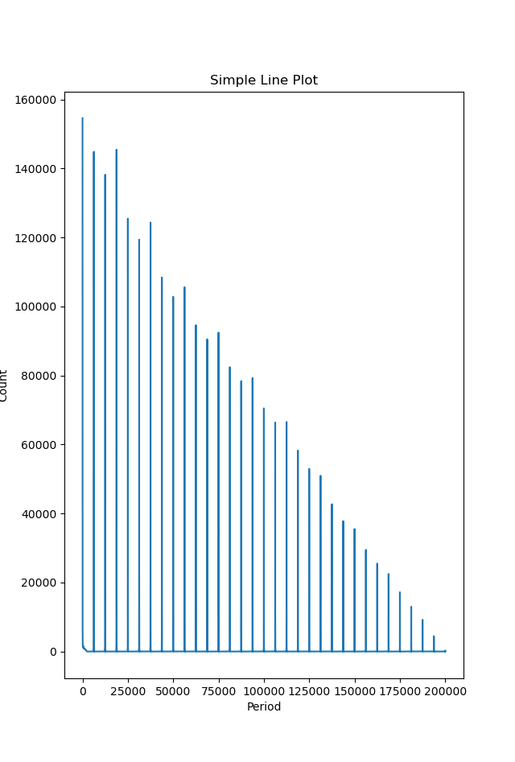

## Motivation
I watch a stream and saw a nice animated background, but there is no source. So I downloaded the video and try to make it myself.

## Usage
``` bash
python hash.py [video_file]
python analysis.py [hash_file]
python clip.py # remember to modify the value
```

## Main goal
- Find the period of loop from the video (count in second or in frame)
- Cut a clips with the information

## Step for loop searching
1. Calculate the hash of each frame
2. Group the frame index with the exact same hash (exact same hash means a really close image)
3. Sort the frame index
4. Compute the frame count between index with same index
5. highest frame count should be the period of the loop.

## Problem for loop searching.
#### Long processing time
- Cause: 1.5 hour long video with 1920x1080 in 30 fps.
- Solve: Lower resolution, but with same framerate.
#### Inefficient to comparing frame pixel by pixel.
- Cause: all kinds of compression, and data loss.
- Solve: Use image hash. With hammer distance 0, should be close enough with unnoticeable difference.
#### Freeze moments
#### Same hash often appear on continuous frame.
- Solve: Counting the frame count that occur most frequently.
- Filter data.
  
Let say there is a video with a loop in 60 frame

For freeze:
It will have a dict like `{"hash": [0,1,2,3,...], ...}`

For continuous frame:
It will have a dict like `{"hash": [0,1,59,60,61,119,120,121,...], ...}`

With the following code, we can find the period between all equal frame.
``` python
def analysis_one_entry(entry):
  freq = {}
  for i, a in enumerate(entry):
      for b in entry[i+1:]:
          v = b-a
          if v not in freq:
              freq.update({v:0})
          freq[v] += 1
  return freq
```

Here is my result, by execute the following command.
``` bash
python hash.py [video_file]
python analysis.py [hash_file]
```

The first peak is 1, which refer to all freeze moment and continuous frame
The second peak is 6250, which is the value we are finding. It means the frame count of period.