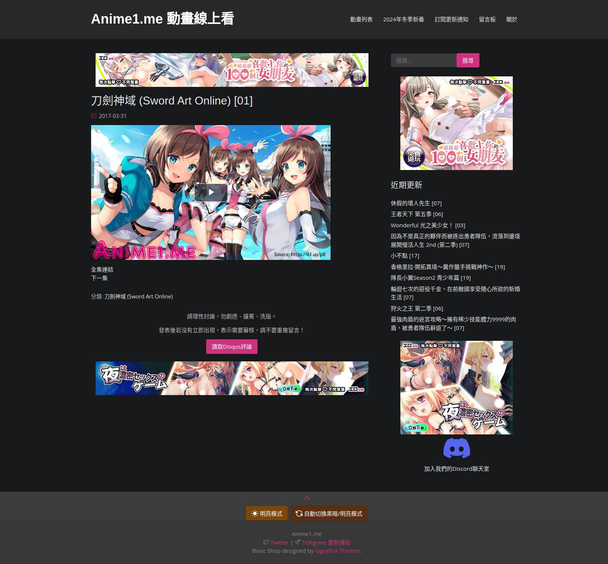
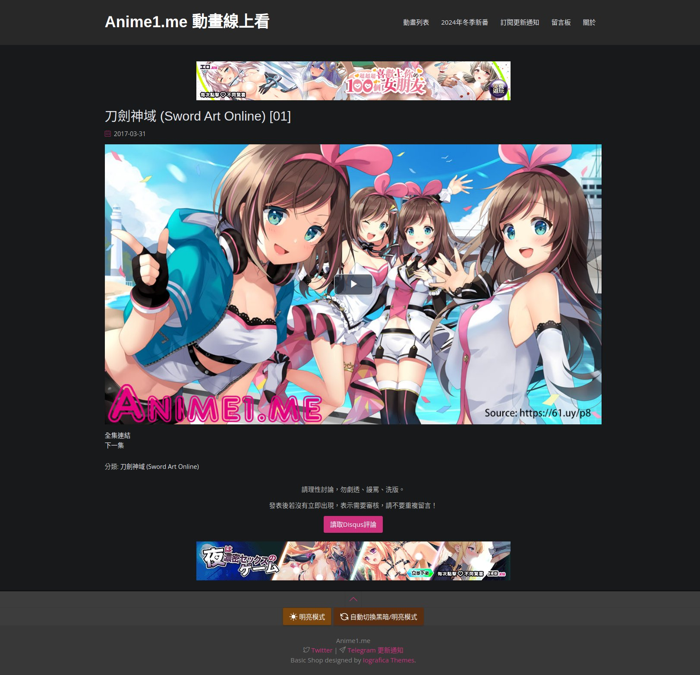

# Anime1 overhaul
Violentmonkey script that modify anime1 website, trying to make it better.

| Before                        | After                      |
| ----------------------------- | -------------------------- |
|  |  |

## ✨ Features
- Set video player to full width (and also disable side bar)
- Disable volume change when scroll on video

## 📝 Note
Feel Free to report issue or new feature.

## 🛠️ Development
https://violentmonkey.github.io/posts/how-to-edit-scripts-with-your-favorite-editor/

1. Create a `xxxx.user.js` file
1. Drag and drop to browser
2. Click `Track external edits` **button**
> P.S. **tick** is to make it as default option for future development
